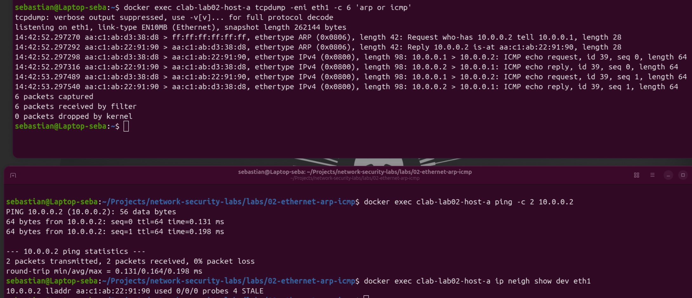
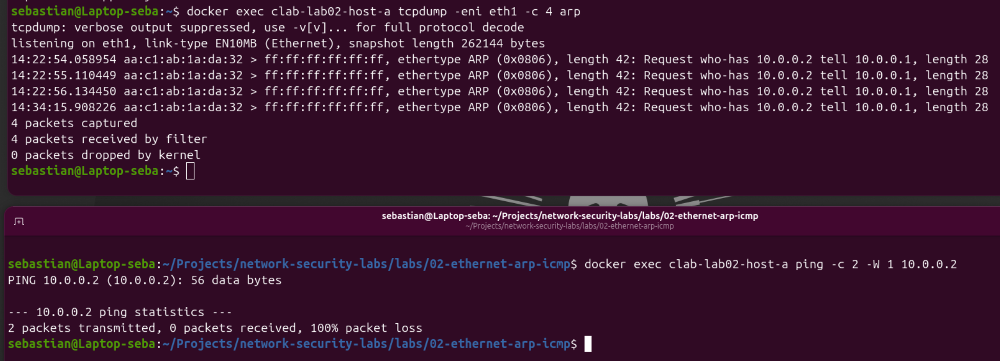

# LAB 02 - Ethernet, ARP and ICMP

## Objective

Observe how two hosts communicate on the same local network using Ethernet, ARP and ICMP.

This lab focuses on understanding Ethernet and ARP behavior, and how they enable IPv4/ICMP communication on a local network.

## Topology

- `host-a`: `10.0.0.1/30`
- `host-b`: `10.0.0.2/30`

Both hosts are connected through `eth1`.

## What was observed

Before sending ICMP traffic, `host-a` did not know the MAC address associated with `10.0.0.2`.

The first communication generated:

1. ARP Request
2. ARP Reply
3. ICMP Echo Request
4. ICMP Echo Reply

After ARP resolution, the IP-to-MAC mapping was stored in the Linux neighbor table.

Subsequent ICMP traffic could be sent without repeating the initial ARP exchange.

## Positive Evidence

The capture below shows successful ARP resolution followed by ICMP communication.

## Negative Evidence

A second test was performed with `10.0.0.2` unavailable.

`host-a` repeatedly sent ARP Requests but received no ARP Reply, so ICMP communication could not be established.

## Defensive Security Perspective

Understanding normal ARP behavior is important for defensive analysis.

A normal baseline helps identify suspicious situations such as:

- unexpected IP-to-MAC changes
- repeated unanswered ARP requests
- abnormal ARP replies
- possible ARP spoofing activity

## Conclusion

This lab demonstrated how ARP resolves IPv4 addresses to MAC addresses before ICMP communication can occur on a local Ethernet network.