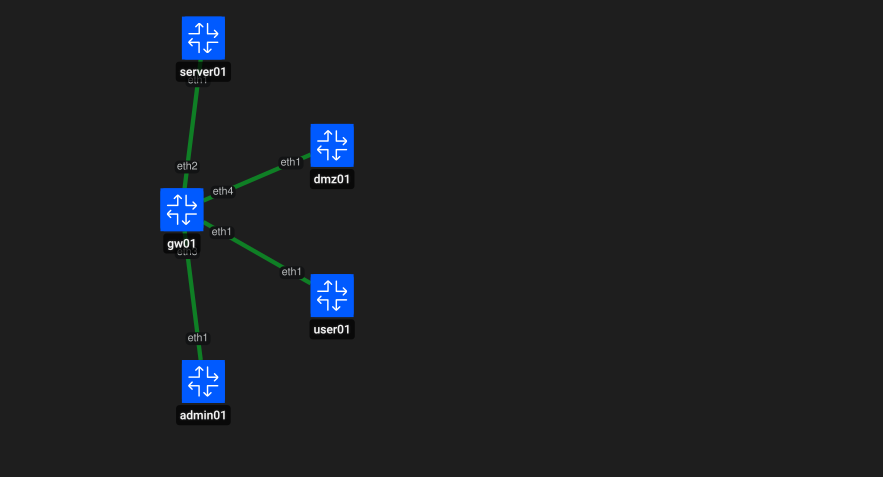
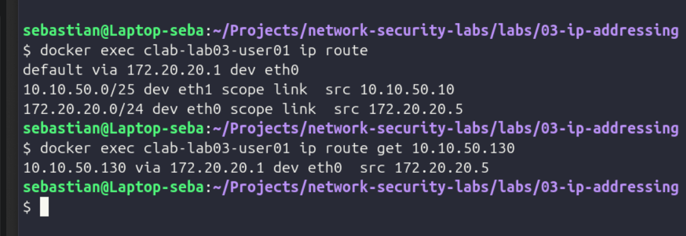
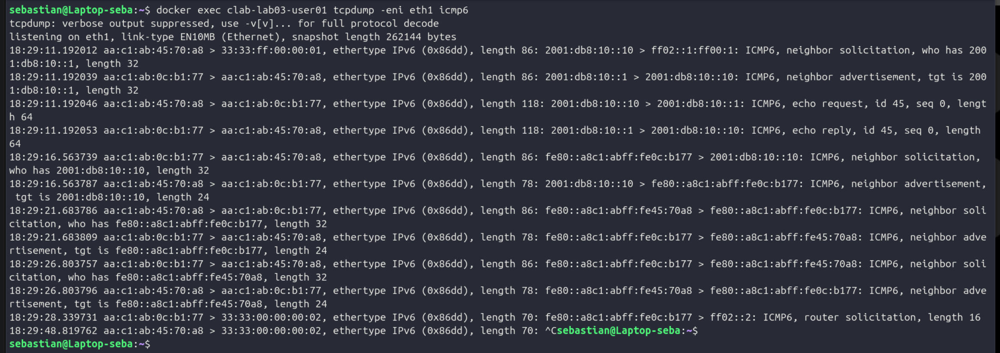

# LAB 03 - IPv4, Subnetting, VLSM and IPv6

## Objective

Design and validate an enterprise-style addressing plan using IPv4, VLSM and IPv6.

The lab focuses on understanding how hosts determine which destinations are directly connected and how IPv6 Neighbor Discovery resolves Layer 3 addresses to Layer 2 addresses.

## Addressing Plan

| Segment | IPv4 Network | IPv6 Network |
|---|---|---|
| USERS | `10.10.50.0/25` | `2001:db8:10::/64` |
| SERVERS | `10.10.50.128/26` | `2001:db8:20::/64` |
| ADMIN | `10.10.50.192/27` | `2001:db8:30::/64` |
| DMZ | `10.10.50.224/28` | `2001:db8:40::/64` |

The subnet sizes were selected using VLSM according to the number of hosts required in each segment.

## Lab Topology

`gw01` is connected to four independent network segments:

- USERS
- SERVERS
- ADMIN
- DMZ

Inter-subnet routing is intentionally not configured in this lab. Routing will be covered in a later lab.

## IPv4 Validation

Linux automatically created a directly connected route for the USERS network:

`10.10.50.0/25 → eth1`

When `user01` evaluated a destination outside that subnet, such as `10.10.50.130`, the host selected another available route instead of treating the destination as directly connected.

## IPv6 and Neighbor Discovery

IPv6 connectivity was also configured for each segment.

Unlike IPv4, IPv6 does not use ARP. Neighbor Discovery Protocol (NDP), based on ICMPv6, was observed during communication between `user01` and `gw01`.

The captured sequence included:

1. Neighbor Solicitation
2. Neighbor Advertisement
3. ICMPv6 Echo Request
4. ICMPv6 Echo Reply

## Defensive Security Relevance

Correct IP addressing and subnetting are fundamental to defensive network security.

Understanding network boundaries helps analysts correctly interpret:

- firewall and ACL rules
- network segmentation
- source and destination ranges in logs
- routing problems
- unexpected traffic between security zones
- IPv6 Neighbor Discovery activity

A subnetting error can unintentionally expose systems to networks that should not have access.

Understanding NDP is also important because IPv6 neighbor relationships can be manipulated in attacks similar in concept to ARP spoofing.

## Conclusion

This lab demonstrated IPv4 subnetting, VLSM, IPv6 addressing and Neighbor Discovery in a segmented enterprise-style network.

These concepts provide the addressing foundation for the routing, VLAN, firewall and network security labs that follow.