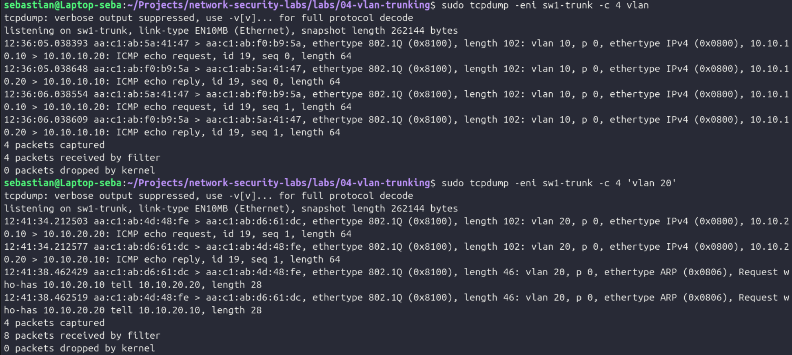
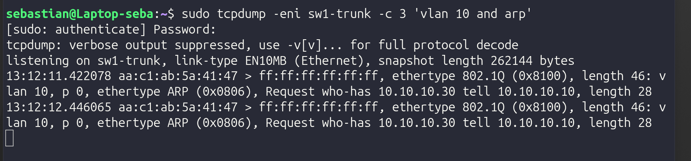
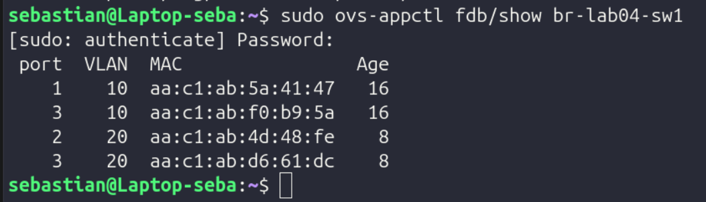

# LAB 04 - Switching, VLANs and 802.1Q Trunking

## Objective

Build a Layer 2 network using Open vSwitch and Containerlab to understand MAC learning, VLAN segmentation, access ports and IEEE 802.1Q trunking.

## Topology

The lab contains two virtual switches:

- VLAN 10 - USERS
- VLAN 20 - SERVERS

Both VLANs are extended between SW1 and SW2 through an 802.1Q trunk.

## VLAN Design

| VLAN | Purpose | Network |
|---|---|---|
| 10 | USERS | `10.10.10.0/24` |
| 20 | SERVERS | `10.10.20.0/24` |

End hosts are connected through access ports, while the link between both switches operates as a trunk carrying VLANs 10 and 20.

## 802.1Q Trunk Validation

Traffic captured on the trunk showed Ethernet frames tagged with their VLAN ID.

This confirms that multiple VLANs can share the same physical or virtual link while remaining logically separated.

## VLAN Isolation

A temporary test placed two hosts in the same IPv4 subnet but in different VLANs.

ARP requests generated in VLAN 10 did not reach the host in VLAN 20, demonstrating Layer 2 isolation between the two broadcast domains.

## MAC Learning

Open vSwitch dynamically learned source MAC addresses and associated them with specific ports and VLANs.

Remote MAC addresses from both VLANs were learned through the trunk port.

## Defensive Security Relevance

VLANs are a fundamental network segmentation control.

Understanding switching and VLAN behavior helps defensive analysts:

- verify that systems are located in the expected security segment
- investigate unexpected Layer 2 connectivity
- identify MAC movement or abnormal MAC learning
- analyze tagged traffic on trunk links
- detect segmentation or trunk configuration errors
- reduce unnecessary broadcast exposure and potential lateral movement

A device connected to the wrong VLAN or an incorrectly configured trunk can expose systems to networks they should not be able to reach.

## Conclusion

This lab demonstrated Layer 2 switching, MAC learning, VLAN segmentation, access ports and 802.1Q trunking.

The lab provides the switching foundation required for later work with redundancy, routing, firewall policies and defensive network controls.