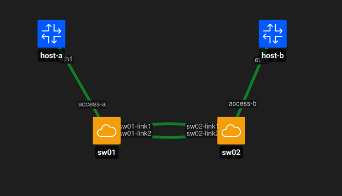

# LAB 05 — L2 Resilience: RSTP, LACP and LLDP

## Objective

Build and validate a resilient Layer 2 topology using Open vSwitch and Containerlab.

This lab focuses on three mechanisms:

- **RSTP (Rapid Spanning Tree Protocol)** to prevent Layer 2 loops and provide path redundancy.
- **LACP (Link Aggregation Control Protocol)** to aggregate multiple physical links into one logical connection.
- **LLDP (Link Layer Discovery Protocol)** to observe Layer 2 neighbor discovery information.

## Lab Topology



The topology contains two Open vSwitch bridges, `sw01` and `sw02`, connected by two parallel links. One host is attached to each switch.

The same physical links are used in two different phases:

1. As independent redundant links controlled by **RSTP**.
2. As members of a single logical **LACP LAG**.

## Tools Used

- Ubuntu Linux
- Docker
- Containerlab
- Open vSwitch
- tcpdump
- Linux networking tools

## RSTP Validation

RSTP was enabled on both switches, with `sw01` configured with the lower bridge priority.

The resulting topology showed:

- `sw01` elected as the **root bridge**.
- One inter-switch link in **Forwarding** state.
- The redundant link in **Alternate / Discarding** state.

This prevents a Layer 2 forwarding loop while keeping a backup path available.

### Failover Test

The active inter-switch link was manually disabled.

RSTP reconverged and the previously blocked link became the new forwarding path, while host connectivity remained available.

Evidence:

- `evidence/01-rstp-root-and-blocked-link.png`
- `evidence/02-rstp-failover.png`

## LACP Validation

After the RSTP tests, the two inter-switch links were reconfigured as members of an LACP bundle.

On each switch, the local logical interface represents one end of the same aggregated connection:

- `sw01` → `lag01`
- `sw02` → `lag02`

LACP successfully negotiated both members, showing them as synchronized, collecting and distributing traffic.

Evidence:

- `evidence/03-lacp-negotiated-bundle.txt`

### LAG Member Failure

One member of the LAG was disabled.

The failed member became unavailable while the remaining member continued carrying traffic. The logical LAG stayed operational.

Evidence:

- `evidence/04-lacp-member-failover.txt`

## LLDP Validation

LLDP was enabled on the inter-switch interfaces and observed directly with `tcpdump`.

The captured frames used EtherType `0x88cc` and exposed information such as:

- Chassis ID
- Port ID
- TTL
- Open vSwitch version
- Bridge capability

This confirmed Layer 2 neighbor advertisements between the two switches.

Evidence:

- `evidence/05-lldp-neighbor-discovery.txt`

## Defensive Security Relevance

Layer 2 resilience is also a defensive security concern.

RSTP helps protect availability by preventing switching loops and broadcast storms. Unexpected topology changes or frequent reconvergence can also be useful indicators during troubleshooting or incident investigation.

LACP provides redundancy at the link level. Monitoring the state of LAG members makes it possible to detect degraded connectivity even when the logical link remains operational.

LLDP provides visibility into directly connected devices and ports. A defensive team can compare the expected topology with the observed topology to identify unexpected neighbors, port changes or infrastructure modifications.

At the same time, LLDP exposes infrastructure information such as interfaces, software and device capabilities, so its use should be understood and controlled.

## Reproducibility

The lab configuration is versioned through:

- `lab05.clab.yml`
- `scripts/setup-ovs.sh`
- `scripts/configure-lacp.sh`
- `scripts/configure-lldp.sh`
- `scripts/cleanup-ovs.sh`

The intended execution flow is:

```text
setup-ovs.sh
    ↓
containerlab deploy
    ↓
RSTP validation
    ↓
configure-lacp.sh
    ↓
LACP validation
    ↓
configure-lldp.sh
    ↓
LLDP capture
```

## Conclusion

This lab demonstrated three complementary Layer 2 mechanisms:

- **RSTP** provides loop prevention and path failover.
- **LACP** provides link aggregation and member-level redundancy.
- **LLDP** provides Layer 2 neighbor visibility.

Together they provide a practical foundation for understanding resilient switching, availability monitoring and defensive network investigation.