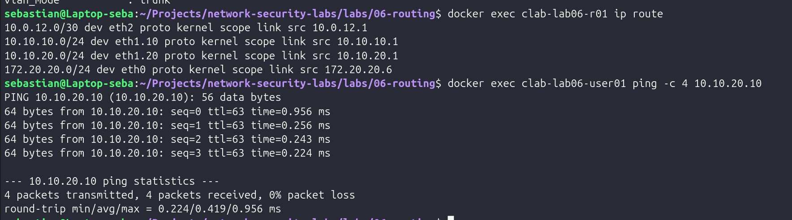
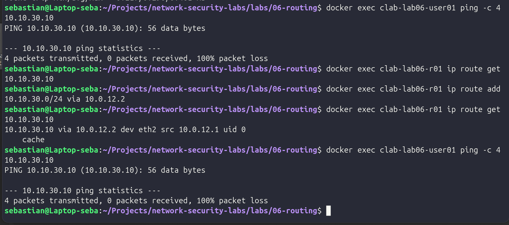
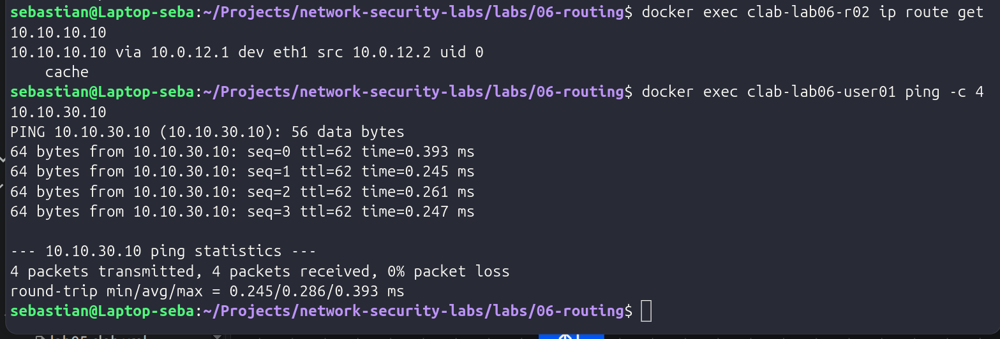
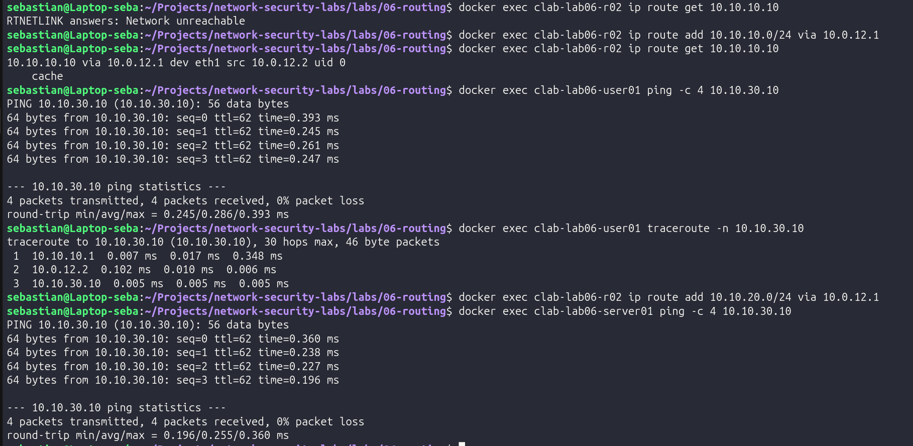

# LAB 06 — Routing Fundamentals and Inter-VLAN Routing

## Objective

Build and validate Layer 3 communication between multiple network segments using Linux routing, Open vSwitch and Containerlab.

This lab focuses on:

- Inter-VLAN routing using an **802.1Q trunk**.
- Linux IP forwarding.
- Directly connected routes.
- Static routes.
- Next-hop routing decisions.
- Bidirectional routing.
- Route troubleshooting with `ip route`, `ping` and `traceroute`.

## Lab Topology



The topology contains:

- **VLAN 10 — USERS**
- **VLAN 20 — SERVERS**
- `r01` as the inter-VLAN router.
- `r02` as a second router.
- A `/30` transit network between both routers.
- A remote LAN behind `r02`.

## Addressing

| Segment | Device | Interface | Address |
|---|---|---|---|
| VLAN 10 — USERS | user01 | eth1 | `10.10.10.10/24` |
| VLAN 10 — USERS | r01 | eth1.10 | `10.10.10.1/24` |
| VLAN 20 — SERVERS | server01 | eth1 | `10.10.20.10/24` |
| VLAN 20 — SERVERS | r01 | eth1.20 | `10.10.20.1/24` |
| Transit | r01 | eth2 | `10.0.12.1/30` |
| Transit | r02 | eth1 | `10.0.12.2/30` |
| Remote LAN | r02 | eth2 | `10.10.30.1/24` |
| Remote LAN | remote01 | eth1 | `10.10.30.10/24` |

## Tools Used

- Ubuntu Linux
- Docker
- Containerlab
- Open vSwitch
- Linux `iproute2`
- tcpdump
- ping
- traceroute

## Inter-VLAN Routing

`user01` belongs to VLAN 10 while `server01` belongs to VLAN 20.

The switch keeps both VLANs separated at Layer 2. Communication between them therefore requires Layer 3 routing.

`r01` uses a single physical interface connected to the switch as an **IEEE 802.1Q trunk**.

Two VLAN subinterfaces are created:

```text
eth1.10 → VLAN 10 → 10.10.10.1/24
eth1.20 → VLAN 20 → 10.10.20.1/24
```

This design is commonly known as **router-on-a-stick**.

Linux IPv4 forwarding was enabled on `r01`, allowing packets to move between the two VLAN interfaces.

The routing table showed both networks as directly connected:

```text
10.10.10.0/24 dev eth1.10
10.10.20.0/24 dev eth1.20
```

A successful ping from `user01` to `server01` confirmed inter-VLAN connectivity.



## 802.1Q Routing Observation

Traffic was captured on the trunk between `sw01` and `r01`.

The capture showed the same ICMP communication using different VLAN tags before and after routing:

```text
VLAN 10 → r01 → VLAN 20
VLAN 20 → r01 → VLAN 10
```

The TTL also decreased after passing through `r01`, confirming that Layer 3 routing occurred.

[View 802.1Q routing capture](evidence/02-inter-vlan-8021q-routing.txt)

## Static Routing

The second part of the lab introduced `r02` and the remote network:

```text
10.10.30.0/24
```

Initially, `r01` had no route toward that network.

A lookup returned:

```text
Network unreachable
```

The following static route was then added to `r01`:

```text
10.10.30.0/24 via 10.0.12.2
```

This provided a path toward the remote LAN through `r02`.

However, connectivity still failed because `r02` had no return route toward VLAN 10.



## Bidirectional Routing

Routing must exist in both directions.

Return routes were added to `r02`:

```text
10.10.10.0/24 via 10.0.12.1
10.10.20.0/24 via 10.0.12.1
```

After configuring the return path, communication between the local VLANs and the remote LAN succeeded.



This demonstrated an important routing principle:

> A valid forward route does not guarantee successful communication if the return path is missing.

## Routing Path Validation

The final routing state allowed both VLAN 10 and VLAN 20 to reach the remote LAN.

A `traceroute` from `user01` to `remote01` showed:

```text
1  10.10.10.1
2  10.0.12.2
3  10.10.30.10
```

This corresponds to:

```text
user01
   ↓
r01
   ↓
r02
   ↓
remote01
```

The same routing architecture was validated from the server network.



## Defensive Security Relevance

Routing knowledge is essential for defensive network operations.

A security analyst must be able to determine:

- Which gateway a host uses.
- Which route a router selects.
- Which segments can communicate.
- Where traffic stops when connectivity fails.
- Whether a return path exists.
- Whether traffic crossed a router or remained inside the same Layer 2 domain.

Understanding routing also provides the foundation for later controls such as:

- Firewalls.
- Access Control Lists.
- Network segmentation.
- Traffic monitoring.
- Incident investigation.

A failed connection is not always caused by a firewall or security control. Missing routes, incorrect gateways or asymmetric paths can produce similar symptoms.

## Reproducibility

The lab configuration is versioned through:

- `lab06.clab.yml`
- `scripts/setup-ovs.sh`
- `scripts/configure-vlans.sh`
- `scripts/configure-static-routes.sh`

The intended execution flow is:

```text
setup-ovs.sh
    ↓
containerlab deploy
    ↓
configure-vlans.sh
    ↓
Inter-VLAN routing validation
    ↓
Static routing tests
    ↓
configure-static-routes.sh
    ↓
Final routing validation
```

## Conclusion

This lab demonstrated how Layer 3 routing connects otherwise isolated network segments.

The main concepts validated were:

- Inter-VLAN routing.
- IEEE 802.1Q trunks.
- Router-on-a-stick.
- Linux IP forwarding.
- Directly connected routes.
- Static routes.
- Next-hop selection.
- Bidirectional routing.
- Route troubleshooting with `ip route`, `ping` and `traceroute`.

These concepts provide the foundation for the next stage of the project, where routing decisions will be learned dynamically using **OSPF**.