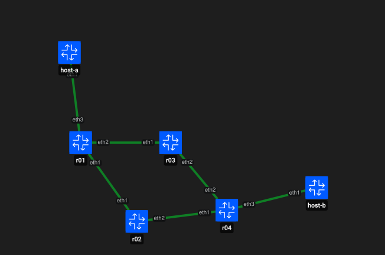
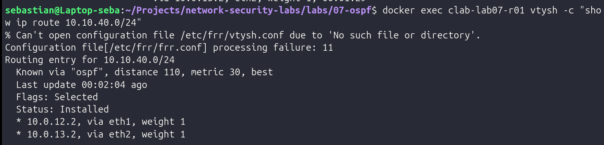
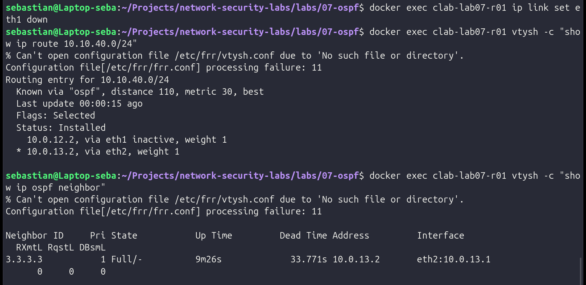
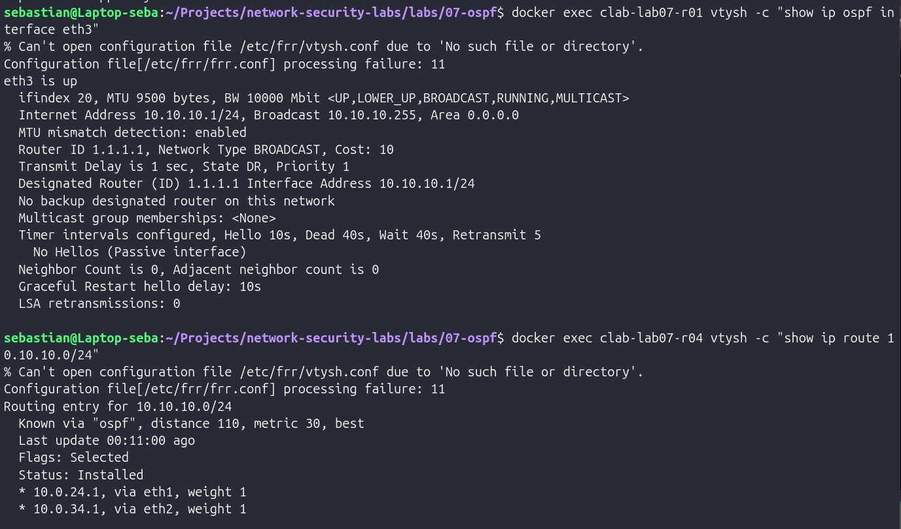
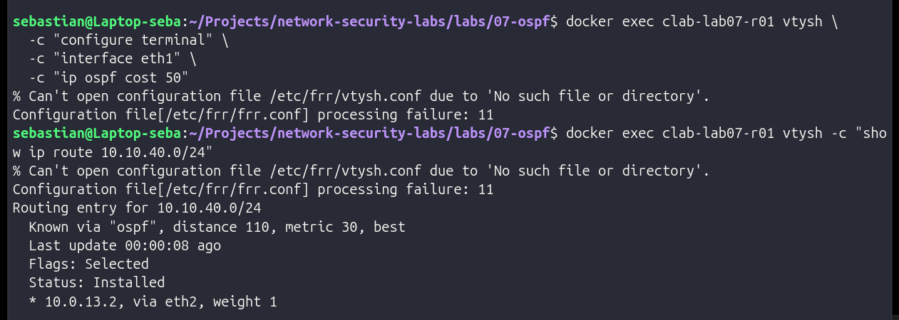

# LAB 07 — OSPF Dynamic Routing and Convergence

## Objective

Build and validate a dynamic routing topology using **OSPF (Open Shortest Path First)** with FRRouting and Containerlab.

This lab focuses on:

- OSPF neighbor discovery and adjacency formation.
- Backbone **Area 0**.
- Dynamic route learning.
- **ECMP (Equal-Cost Multi-Path)** routing.
- Automatic convergence after a link failure.
- OSPF cost-based path selection.
- Passive interfaces.
- OSPF Hello packet inspection.
- Defensive monitoring of routing infrastructure.

## Lab Topology

The topology contains four FRRouting routers connected through redundant Layer 3 paths.

Two endpoint networks are located behind `r01` and `r04`.

| Segment | Device | Address |
|---|---|---|
| LAN A | host-a | `10.10.10.10/24` |
| LAN A Gateway | r01 | `10.10.10.1/24` |
| r01 ↔ r02 | r01 | `10.0.12.1/30` |
| r01 ↔ r02 | r02 | `10.0.12.2/30` |
| r01 ↔ r03 | r01 | `10.0.13.1/30` |
| r01 ↔ r03 | r03 | `10.0.13.2/30` |
| r02 ↔ r04 | r02 | `10.0.24.1/30` |
| r02 ↔ r04 | r04 | `10.0.24.2/30` |
| r03 ↔ r04 | r03 | `10.0.34.1/30` |
| r03 ↔ r04 | r04 | `10.0.34.2/30` |
| LAN B Gateway | r04 | `10.10.40.1/24` |
| LAN B | host-b | `10.10.40.10/24` |

The OSPF Router IDs are:

- `r01` → `1.1.1.1`
- `r02` → `2.2.2.2`
- `r03` → `3.3.3.3`
- `r04` → `4.4.4.4`

All OSPF links belong to **Area 0**, the OSPF backbone area.

## Tools Used

- Ubuntu Linux
- Docker
- Containerlab
- FRRouting 10.6.1
- OSPFv2
- vtysh
- tcpdump
- ping
- traceroute

## OSPF Neighbor Formation

After deployment, `r01` automatically discovered `r02` and `r03` as OSPF neighbors.

Both adjacencies reached the **Full** state, confirming that the routers had completed the OSPF adjacency process and could exchange routing information.

Unlike LAB 06, no static route toward the remote LAN was manually configured.

OSPF dynamically learned the remote network `10.10.40.0/24`.

## ECMP Route Learning

The topology provides two paths from `r01` to the remote LAN:

- `r01 → r02 → r04`
- `r01 → r03 → r04`

Both paths initially had the same OSPF cost.

FRRouting therefore installed two next hops toward `10.10.40.0/24`:

- `10.0.12.2` through `eth1`
- `10.0.13.2` through `eth2`

This demonstrates **ECMP (Equal-Cost Multi-Path)** routing, where multiple paths with the same metric can coexist in the routing table.

End-to-end connectivity between `host-a` and `host-b` was successfully validated.

## OSPF Failover and Convergence

The link between `r01` and `r02` was manually disabled to simulate a network failure.

OSPF detected the topology change and removed the affected path from active forwarding.

The route through `r02` became inactive, while the alternative path remained available through:

`r01 → r03 → r04`

The OSPF neighbor relationship with `r02` disappeared, while the adjacency with `r03` remained in the **Full** state.

Connectivity to the remote LAN continued through the surviving path.

This demonstrates one of the main advantages of dynamic routing: the network can automatically adapt to topology changes without manually modifying static routes.

## OSPF Hello Packets

OSPF control traffic was captured directly on the link between `r01` and `r02`.

The capture showed OSPFv2 Hello packets exchanged between both routers using IP protocol `89`.

The packets were sent to `224.0.0.5`, the **AllSPFRouters** multicast address.

The capture also exposed information such as:

- Router ID.
- Area ID.
- Hello interval.
- Dead interval.
- Neighbor Router ID.
- Network mask.
- Authentication status.

The observed timers were:

- Hello interval: `10 seconds`
- Dead interval: `40 seconds`

The capture also showed that OSPF authentication was not configured in this lab.

[View OSPF Hello packet capture](evidence/03-ospf-hello-packets.txt)

## Passive Interface Validation

The LAN interface on `r01` was configured as an OSPF passive interface.

The network `10.10.10.0/24` was still advertised through OSPF, but `r01` did not send OSPF Hello packets or attempt to establish neighbor relationships with `host-a`.

The interface output confirmed:

**No Hellos — Passive interface**

At the same time, `r04` successfully learned `10.10.10.0/24` through OSPF.

This demonstrates an important distinction:

**A passive OSPF interface can advertise its connected network without forming OSPF neighbors on that interface.**

## OSPF Cost and Path Selection

The two original routes toward `10.10.40.0/24` had equal cost.

To observe OSPF path selection, the cost of the `r01 → r02` interface was manually increased to `50`.

OSPF recalculated the shortest path and selected only:

`r01 → r03 → r04`

The route through `r02` was no longer part of ECMP because its accumulated metric was higher.

After validation, the manual cost was removed and the topology returned to its original ECMP state.

## Defensive Security Relevance

Dynamic routing protocols are part of the network control plane and are therefore relevant to defensive security operations.

A defender should understand the expected routing topology and monitor for events such as:

- Unexpected OSPF neighbors.
- Neighbor adjacency loss.
- Frequent routing reconvergence.
- Unexpected route advertisements.
- Changes in OSPF metrics.
- Unexpected path selection.
- Routing interfaces becoming unavailable.
- OSPF traffic appearing on segments where routing protocols are not expected.

The OSPF packet capture also demonstrated that routing protocols expose infrastructure information such as Router IDs, network ranges, timers and neighbor relationships.

In this lab, OSPF authentication was not enabled. This provides a useful baseline for understanding why routing protocol authentication and control-plane protection become important in secured network environments.

Passive interfaces also reduce unnecessary OSPF exposure by preventing neighbor formation on endpoint-facing networks.

Understanding normal routing behavior is essential before routing anomalies can be identified during troubleshooting or incident investigation.

## Reproducibility

The lab configuration is versioned through:

- `lab07.clab.yml`
- `configs/daemons`
- `configs/vtysh.conf`
- `configs/r01/frr.conf`
- `configs/r02/frr.conf`
- `configs/r03/frr.conf`
- `configs/r04/frr.conf`

The following scripts reproduce the main validation scenarios:

- `scripts/validate-ospf.sh` — validates neighbors, routes and endpoint connectivity.
- `scripts/failover-test.sh` — simulates an inter-router link failure and validates OSPF convergence.
- `scripts/cost-path-test.sh` — modifies an OSPF cost, validates path selection and restores the original state.

Containerlab handles the creation and destruction of the complete topology, while the FRRouting configuration remains versioned in the repository.

## Evidence

The lab includes the following technical evidence:

- OSPF route learning with two ECMP next hops.
- Automatic convergence after an inter-router link failure.
- Real OSPF Hello packets captured with tcpdump.
- Passive-interface behavior and remote route propagation.
- OSPF cost-based path selection.

## Conclusion

This lab demonstrated how OSPF dynamically builds and maintains routing information across a redundant network topology.

The main concepts validated were:

- OSPF neighbor formation.
- Area 0 operation.
- Dynamic route learning.
- ECMP routing.
- Automatic convergence.
- Redundant routing paths.
- Passive interfaces.
- OSPF Hello packets.
- Cost-based path selection.
- Control-plane visibility from a defensive security perspective.

Unlike static routing, OSPF allows routers to exchange network information and automatically recalculate forwarding paths when the topology changes.

This provides the foundation for understanding larger routed networks and for monitoring routing behavior from a defensive Blue Team perspective.