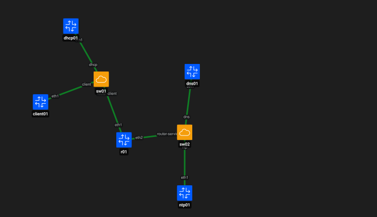
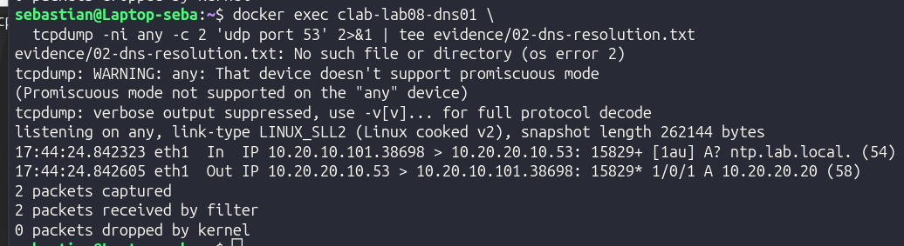
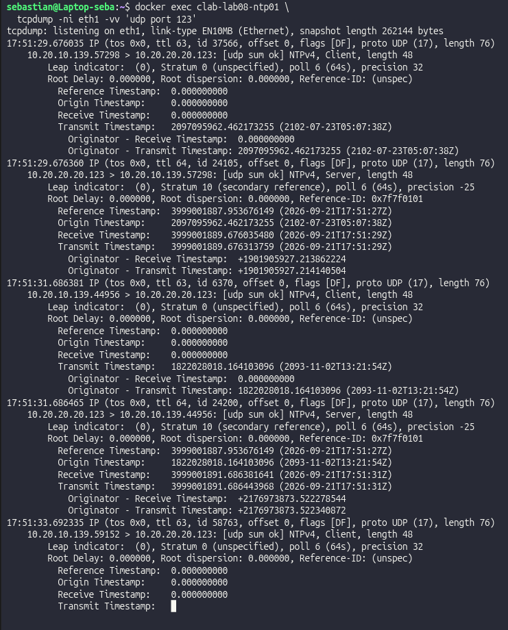
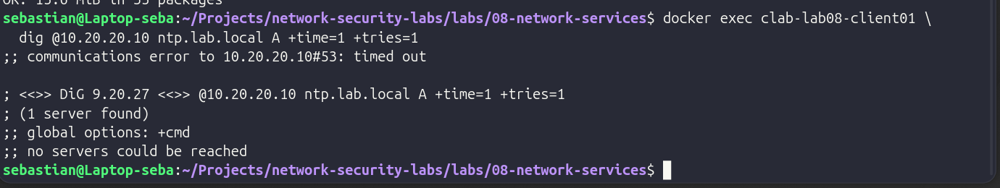

# LAB 08 – DHCP, DNS and NTP

## Objective

Deploy and analyze essential network services used by endpoints in an enterprise environment:

- **DHCP (Dynamic Host Configuration Protocol)** for automatic IP configuration.
- **DNS (Domain Name System)** for internal name resolution.
- **NTP (Network Time Protocol)** for time synchronization.
- Routing between the client and services networks.
- Basic troubleshooting of a service failure caused by incorrect routing.

The lab focuses on understanding how these services behave on the network and why they are important for defensive security and incident investigation.

---

## Lab Architecture

Two Layer 2 networks are connected through `r01`:

**Client LAN – `10.20.10.0/24`**

- `client01` – DHCP client
- `dhcp01` – `10.20.10.2`
- `r01` – `10.20.10.1`

**Services LAN – `10.20.20.0/24`**

- `r01` – `10.20.20.1`
- `dns01` – `10.20.20.10`
- `ntp01` – `10.20.20.20`

Open vSwitch provides the Layer 2 connectivity between nodes.

---

## DHCP

`client01` starts without an IPv4 address on the lab interface.

The DHCP server provides:

- IPv4 address from `10.20.10.100–150`
- Subnet mask `/24`
- Default gateway `10.20.10.1`
- DNS server `10.20.20.10`
- Lease time of 3600 seconds

Packet capture confirmed the complete DHCP DORA process:

**Discover → Offer → Request → ACK**

[View DHCP DORA evidence](evidence/01-dhcp-dora.txt)

---

## DNS

The internal DNS server runs on `10.20.20.10`.

The client successfully queried:

`ntp.lab.local → 10.20.20.20`

Because the client and DNS server are located in different subnets, the DNS traffic must be routed through `r01`.

The packet capture confirmed both the DNS query and response over UDP port 53.

---

## NTP

`ntp01` provides an internal NTP service using Chrony.

The client queried `10.20.20.20` over UDP port 123 without modifying its system clock.

Packet capture confirmed:

**NTP Client Request → NTP Server Response**

The server operated as a local **Stratum 10** reference.

---

## Troubleshooting Test

The route from `client01` to `10.20.20.0/24` was intentionally removed.

Without the correct route, the client attempted to reach the DNS server through the Containerlab management network instead of through `r01`.

The DNS query then timed out even though the DNS service itself remained operational.

This demonstrates an important troubleshooting principle:

**A service timeout does not necessarily mean the service is down. The routing path must also be verified.**

---

## Defensive Security Relevance

These infrastructure services provide important context during Blue Team investigations.

**DHCP** helps determine which IP address was assigned to a device at a specific time.

**DNS** provides visibility into which systems and domains an endpoint attempted to resolve.

**NTP** maintains consistent timestamps between systems, which is essential when correlating logs and reconstructing incident timelines.

Understanding the underlying routing path is also necessary to distinguish application or service failures from network connectivity problems.

---

## Tools Used

- Containerlab
- Docker
- Alpine Linux
- Open vSwitch
- dnsmasq
- Chrony
- tcpdump
- dig / nslookup
- Linux networking tools

---

## Key Takeaways

LAB 08 demonstrated how DHCP, DNS and NTP operate as foundational network services and how their traffic can be directly observed and validated.

The lab also showed that successful service operation depends not only on the application itself, but also on correct Layer 3 connectivity and routing.

For defensive security, these protocols provide valuable information for network monitoring, troubleshooting, log correlation and incident reconstruction.