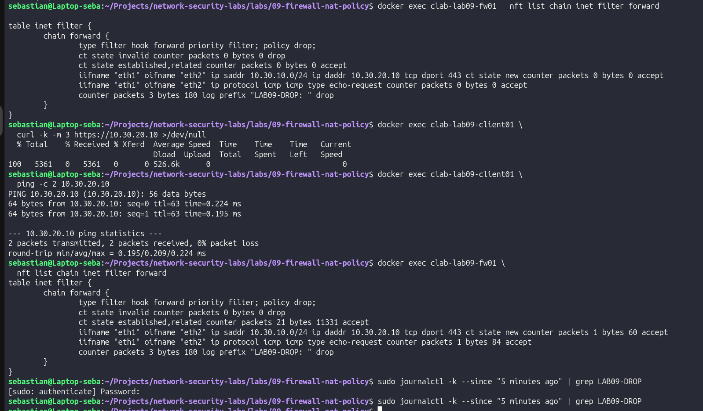
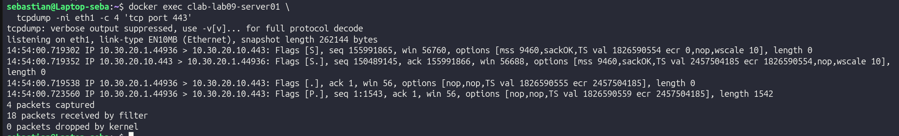

# LAB 09 – NAT, Stateful Firewall and Network Policy

## Objective

Build a Linux firewall between a trusted internal network and a simulated untrusted external network.

The lab demonstrates:

- Layer 3 routing through a Linux firewall.
- Stateful packet filtering with `nftables`.
- Default-deny network policy.
- HTTPS access over TCP/443.
- Blocking unauthorized TCP/8080 traffic.
- Connection tracking.
- Source NAT (SNAT).
- Troubleshooting traffic before and after NAT.

---

## Lab Architecture

### Internal / Trusted Network

`10.30.10.0/24`

- `client01` – `10.30.10.10/24`
- `fw01 eth1` – `10.30.10.1/24`

### External / Untrusted Network

`10.30.20.0/24`

- `fw01 eth2` – `10.30.20.1/24`
- `server01` – `10.30.20.10/24`

`sw01` and `sw02` operate as Layer 2 Open vSwitch bridges.

`fw01` acts as the Layer 3 boundary between both networks and provides routing, stateful filtering and SNAT.

---

## Network Policy

The firewall uses a default-deny policy.

| Source | Destination | Service | Action |
|---|---|---|---|
| Internal network | `server01` | HTTPS TCP/443 | Allow |
| Internal network | `server01` | HTTP TCP/8080 | Drop |
| Internal network | `server01` | ICMP Echo | Allow |
| Established / Related | Internal client | Return traffic | Allow |
| Other traffic | Any | Any | Drop |

The allowed HTTPS service uses a temporary self-signed TLS certificate for laboratory purposes.

---

## Stateful Firewall

The firewall uses Linux connection tracking to distinguish between new and existing connections.

A new HTTPS connection from `client01` to TCP/443 is explicitly allowed.

After the connection is accepted, return traffic and subsequent packets are handled as:

`ESTABLISHED / RELATED`

Traffic that does not match an allowed policy reaches the final drop rule.

The firewall counters confirmed:

- New HTTPS connections accepted.
- Established traffic accepted.
- ICMP traffic accepted.
- Unauthorized TCP/8080 traffic dropped.

This demonstrates that a stateful firewall does not treat every packet independently. It maintains information about previously accepted connections.

---

## Default Deny

The forwarding chain uses a default `drop` policy.

Only explicitly authorized traffic can cross the security boundary.

The resulting policy was:

`HTTPS/443 → ALLOW`

`HTTP/8080 → DROP`

`Other unauthorized traffic → DROP`

This approach reduces unnecessary network exposure and follows the principle of least privilege.

---

## Source NAT

Initially, `server01` required a route back to the internal network:

`10.30.10.0/24 → 10.30.20.1`

Without that route, the server did not know how to correctly return traffic to `client01`.

SNAT was then configured on `fw01`.

Before translation:

`10.30.10.10 → 10.30.20.10`

After translation:

`10.30.20.1 → 10.30.20.10`

The server therefore sees the connection as originating from the external interface of the firewall instead of directly from the internal client.

With SNAT active, `server01` no longer requires knowledge of the internal `10.30.10.0/24` network.

The firewall tracks the translation and automatically performs the reverse translation for response traffic.

---

## NAT vs Firewalling

NAT and firewall filtering perform different functions.

**Firewalling** determines whether traffic is authorized to cross the network boundary.

**NAT** changes addressing information so traffic can communicate between networks with different routing requirements.

In this lab:

- TCP/443 is permitted by the firewall and translated by SNAT.
- TCP/8080 is blocked by the firewall and cannot bypass the policy simply because NAT is enabled.

NAT is therefore not a replacement for firewall security policy.

---

## Defensive Security Relevance

Stateful firewall logs, connection states and NAT information are important during Blue Team investigations.

An analyst may need to determine:

- Which host initiated a connection.
- Which destination and port were contacted.
- Whether traffic was allowed or blocked.
- Whether the traffic belonged to an established connection.
- Whether the source address visible in logs is the original endpoint or a translated NAT address.
- Whether a timeout is caused by routing, firewall policy or the destination service.

Understanding these concepts is important when analyzing enterprise firewall, IDS/IPS, SIEM and network telemetry.

---

## Tools Used

- Containerlab
- Docker
- Alpine Linux
- Open vSwitch
- nftables
- Linux conntrack
- tcpdump
- curl
- OpenSSL
- darkhttpd

---

## Deploy and Validation

### 1. Create the Open vSwitch bridges

Run:

`./scripts/setup-ovs.sh`

This creates the Layer 2 bridges used by the Internal and External networks.

### 2. Deploy the laboratory

Run:

`sudo containerlab deploy -t lab09.clab.yml`

The deployment creates:

- `client01`
- `fw01`
- `server01`

The firewall automatically loads the nftables policy and enables IPv4 forwarding.

### 3. Verify the containers

Run:

`docker ps --filter name=clab-lab09`

All LAB 09 containers should be in the `Up` state.

### 4. Validate allowed HTTPS traffic

Run:

`docker exec clab-lab09-client01 curl -k -m 3 https://10.30.20.10`

The HTTPS connection over TCP/443 should succeed.

### 5. Validate blocked traffic

Run:

`docker exec clab-lab09-client01 curl -m 3 http://10.30.20.10:8080`

The connection should time out because TCP/8080 is blocked by the firewall policy.

### 6. Inspect the firewall

Run:

`docker exec clab-lab09-fw01 nft list ruleset`

This displays the active stateful filtering and SNAT rules.

### 7. Destroy the laboratory

Run:

`sudo containerlab destroy -t lab09.clab.yml`

Then remove the Open vSwitch bridges:

`./scripts/cleanup-ovs.sh`

## Key Takeaways

LAB 09 demonstrated how routing, stateful firewalling and NAT work together at a network security boundary.

The main concepts practiced were:

- Default-deny firewall policy.
- Explicit service authorization.
- Connection tracking.
- Stateful return traffic.
- Traffic blocking.
- Source address translation.
- Network troubleshooting across security zones.

The lab also demonstrated an important defensive principle:

**A connection may be affected independently by routing, firewall policy and NAT, and each layer must be investigated separately during troubleshooting.**