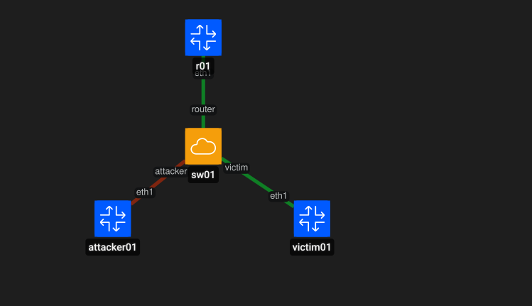
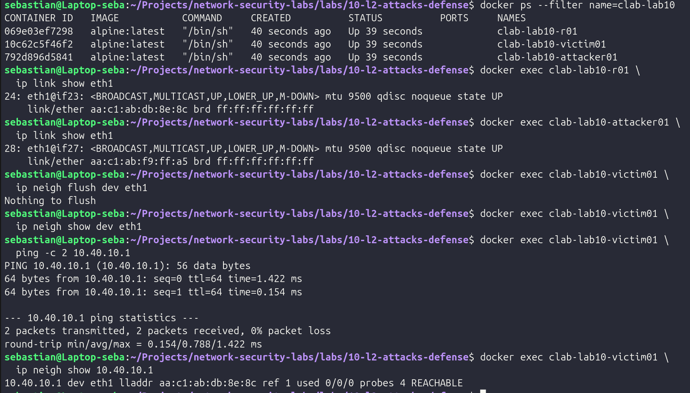
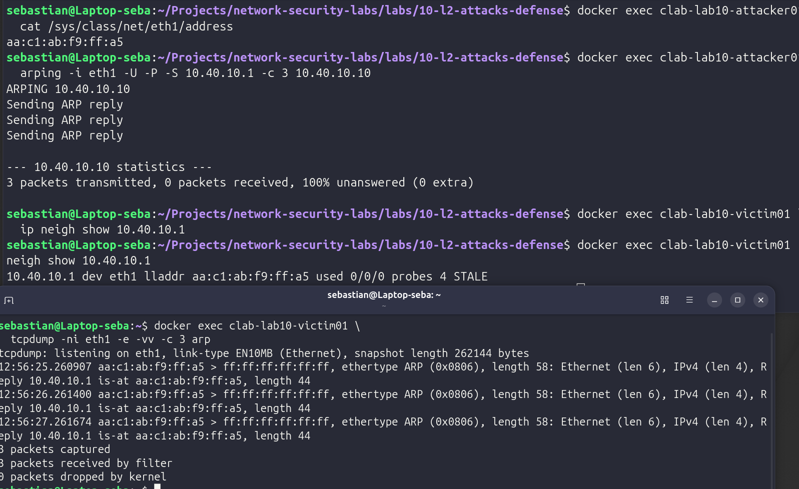
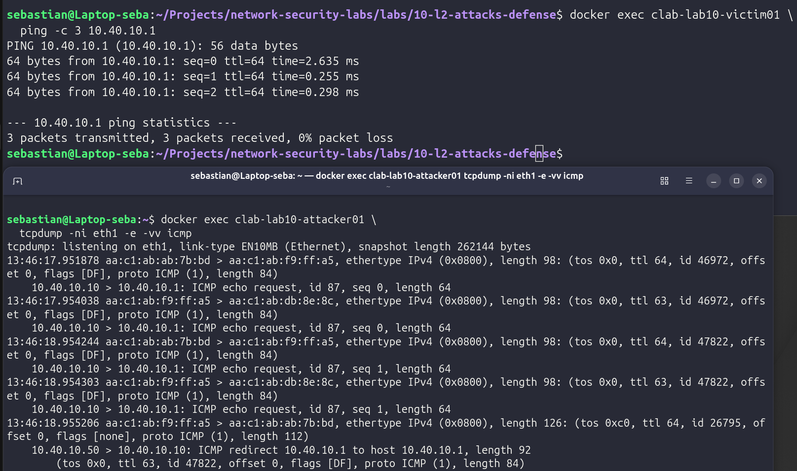
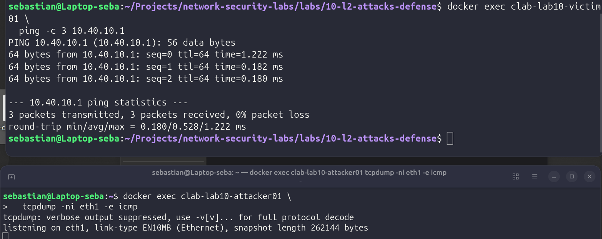
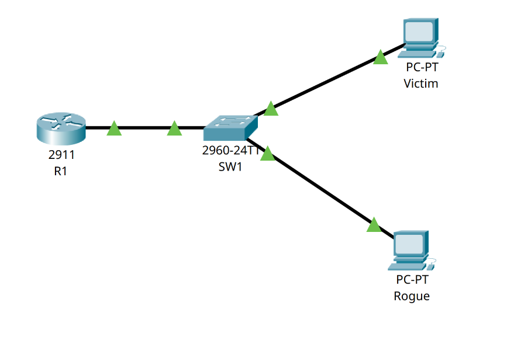
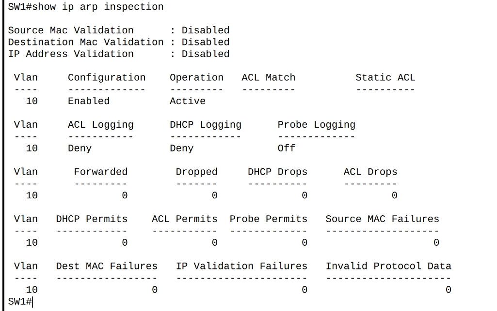

# LAB 10 – ARP Spoofing Detection and Layer 2 Defensive Controls

## Objective

Investigate a controlled ARP spoofing incident in an isolated Layer 2 network and apply an Incident Response workflow from detection through recovery.

The lab also explores enterprise Layer 2 defensive controls using Cisco Packet Tracer, including DHCP Snooping and Dynamic ARP Inspection (DAI).

---

## Lab Architecture

### Containerlab / Linux Environment

Network: `10.40.10.0/24`

| Device | Interface | Address | Role |
|---|---|---|---|
| `r01` | eth1 | `10.40.10.1/24` | Legitimate router / default gateway |
| `victim01` | eth1 | `10.40.10.10/24` | Monitored endpoint |
| `attacker01` | eth1 | `10.40.10.50/24` | Controlled test endpoint |
| `sw01` | Layer 2 | — | Open vSwitch access switch |

All nodes share the same Layer 2 broadcast domain.

The Containerlab management network on `eth0` is not part of the experiment.

---

## Normal ARP Baseline

Before introducing suspicious activity, the legitimate gateway association was established.

`victim01` resolved:

`10.40.10.1 → MAC address of r01`

The baseline confirmed that the gateway IP was associated with the legitimate router interface.

---

## ARP Spoofing Detection

Controlled forged ARP replies were generated from `attacker01`.

The advertisements falsely claimed:

`10.40.10.1 → MAC address of attacker01`

Packet capture confirmed repeated ARP replies containing the false association.

The neighbor table on `victim01` subsequently changed from the legitimate gateway MAC to the attacker's MAC.

---

## Incident Analysis

After the ARP cache was poisoned, traffic from `victim01` to the gateway was redirected through `attacker01`.

Although the Layer 3 destination remained:

`10.40.10.1`

the Layer 2 destination became the MAC address of `attacker01`.

Observed traffic path:

`victim01 → attacker01 → r01`

Packet capture also showed the TTL decreasing while the traffic was forwarded through the unauthorized endpoint.

Connectivity remained operational during the incident, demonstrating that ARP spoofing can redirect traffic without necessarily producing an obvious outage.

---

## Containment

The suspicious endpoint was isolated by administratively disabling its Open vSwitch access port.

The container remained available for investigation while its ability to continue sending forged ARP advertisements was removed.

---

## Eradication

The poisoned ARP entry was removed from `victim01`.

A new legitimate ARP resolution restored:

`10.40.10.1 → MAC address of r01`

This removed the malicious Layer 2 state created during the incident.

---

## Recovery

Connectivity between `victim01` and the legitimate gateway was validated after restoring the correct ARP association.

The suspicious endpoint remained isolated during recovery.

Traffic from the victim no longer traversed the unauthorized system.

---

## Cisco Layer 2 Defensive Controls

Cisco Packet Tracer was used to explore enterprise controls designed to reduce ARP spoofing risk.

The Cisco topology contains:

- Cisco 2911 router `R1`
- Cisco 2960 switch `SW1`
- Legitimate `Victim` endpoint
- Controlled `Rogue` endpoint
- VLAN 10 – USERS
- Network `10.40.10.0/24`

DHCP Snooping successfully learned the legitimate binding for the victim:

`MAC ↔ 10.40.10.100 ↔ VLAN 10 ↔ Fa0/1`

Dynamic ARP Inspection was then enabled for VLAN 10.

---

## Packet Tracer Limitation

Packet Tracer 9.0.1 accepted the DHCP Snooping and Dynamic ARP Inspection configuration and displayed DAI as enabled and active.

However, the simulator did not enforce the expected DAI forwarding behavior in this scenario.

ARP inspection counters remained at zero and the statically configured rogue endpoint continued resolving the gateway.

Therefore:

- The Cisco portion demonstrates the configuration of the preventive controls.
- Actual ARP spoofing, traffic redirection, containment and recovery were validated in the Containerlab/Linux environment.
- DAI enforcement should be validated on physical or fully emulated Cisco platforms when required.

The observed simulator limitation is documented rather than treated as successful enforcement.

---

## Incident Response Workflow

This lab followed the seven-phase Incident Response process:

`Preparation → Detection → Analysis → Containment → Eradication → Recovery → Lessons Learned`

The complete investigation is documented in:

[Incident Response Report](incident-report.md)

---

## Defensive Security Relevance

ARP spoofing can manipulate the relationship between Layer 3 addresses and Layer 2 identities.

For a defensive analyst, useful indicators include:

- Unexpected changes in the gateway MAC address.
- Unsolicited ARP replies.
- Multiple MAC addresses claiming the same IP.
- Traffic unexpectedly traversing another endpoint.
- Changes in ARP or neighbor tables.

Relevant preventive controls include DHCP Snooping, Dynamic ARP Inspection, ARP ACLs, access-port monitoring and rapid endpoint isolation.

---

## Reproducing the Containerlab Scenario

### Prepare the Layer 2 switch

`./scripts/setup-ovs.sh`

### Deploy the topology

`sudo containerlab deploy -t lab10.clab.yml`

### Establish the legitimate baseline

`./scripts/baseline.sh`

### Generate the controlled ARP spoofing activity

`./scripts/simulate-arp-spoof.sh`

### Contain the suspicious endpoint

`./scripts/contain-attacker.sh`

### Restore and validate the legitimate state

`./scripts/recover.sh`

### Reset the scenario for another test

`./scripts/reset-lab.sh`

### Destroy the topology

`sudo containerlab destroy -t lab10.clab.yml`

### Remove the Open vSwitch bridge

`./scripts/cleanup-ovs.sh`

---

## Tools Used

- Containerlab
- Docker
- Alpine Linux
- Open vSwitch
- tcpdump
- arping
- Linux neighbor table
- Cisco Packet Tracer 9.0.1
- Cisco IOS
- DHCP Snooping
- Dynamic ARP Inspection

---

## Key Takeaways

LAB 10 demonstrated that ARP spoofing can successfully alter a host's gateway association and redirect traffic through an unauthorized system while normal connectivity remains available.

The investigation also demonstrated the importance of separating:

**Detection** – suspicious activity was observed.

**Analysis** – successful traffic redirection was confirmed.

**Containment** – the suspicious endpoint was isolated.

**Eradication** – the poisoned ARP state was removed.

**Recovery** – the legitimate gateway association and normal traffic path were restored.

The Cisco portion extended the investigation into enterprise Layer 2 preventive controls and documented the limitations encountered when validating DAI behavior in Packet Tracer.