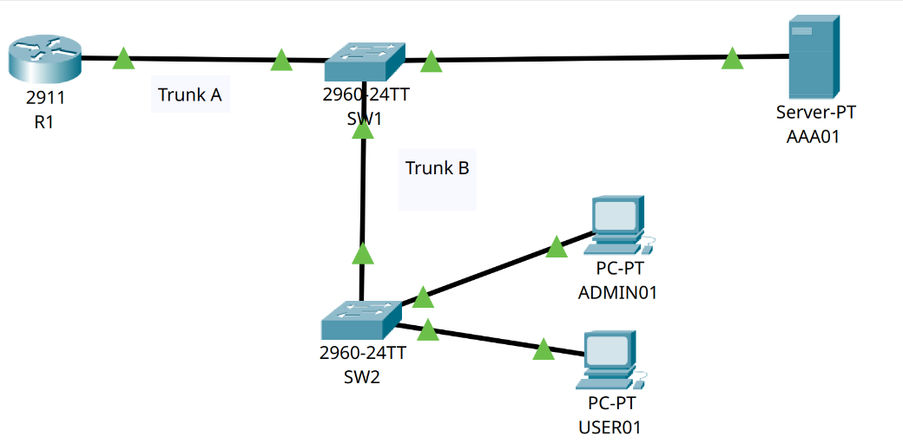
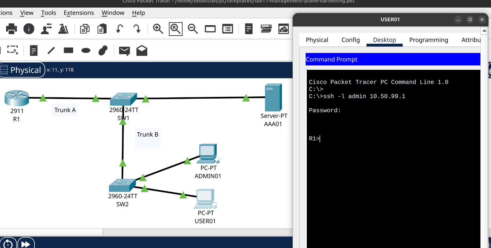
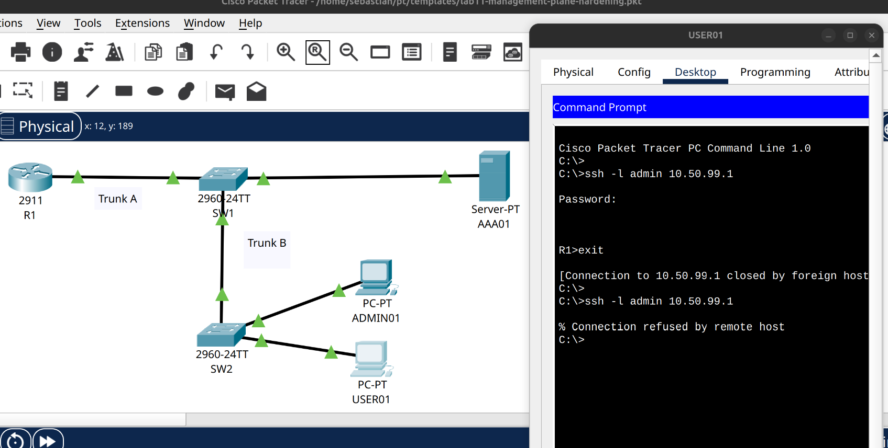
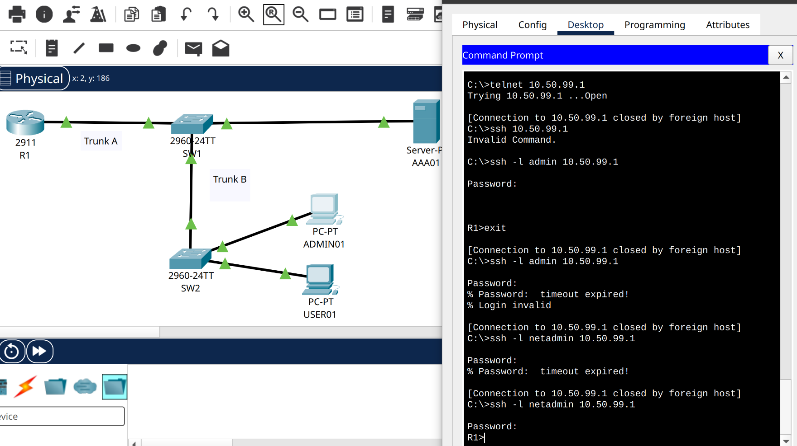
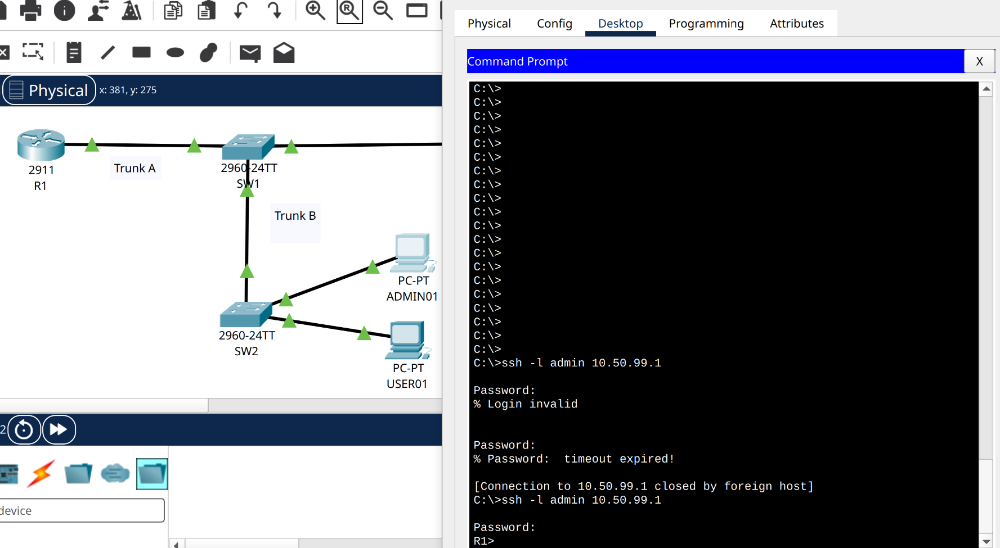
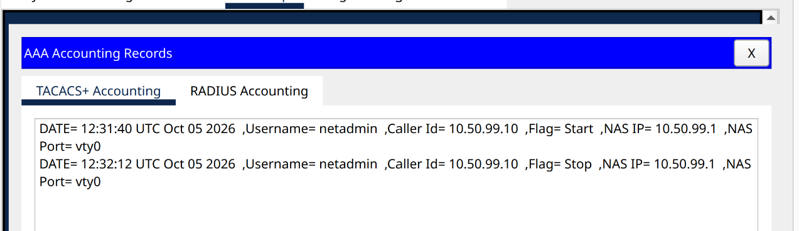

# LAB 11 – Management Plane Hardening and AAA

## Objective

Build and secure the management plane of a small enterprise-style Cisco network.

The lab focuses on controlling:

- who can administer network devices,
- from which network administration is allowed,
- how administrators authenticate,
- how privileged access is separated,
- and how administrative sessions are recorded.

The environment includes VLAN segmentation, two IEEE 802.1Q trunks, Router-on-a-Stick, SSH, management ACLs and centralized AAA using TACACS+.

---

## Architecture

The lab contains:

- Cisco 2911 router `R1`
- Cisco 2960 switch `SW1`
- Cisco 2960 switch `SW2`
- Management workstation `ADMIN01`
- Standard user workstation `USER01`
- Centralized AAA server `AAA01`

Two trunk links are used:

- **Trunk A:** `R1 ↔ SW1`
- **Trunk B:** `SW1 ↔ SW2`

Both trunks transport VLAN 10 and VLAN 99.

A trunk allows multiple VLANs to share the same physical Ethernet link using IEEE 802.1Q tagging.

---

## Network Segmentation

Two VLANs were created.

### VLAN 10 – USERS

Network:

`10.50.10.0/24`

Used for standard user endpoints.

### VLAN 99 – MANAGEMENT

Network:

`10.50.99.0/24`

Used for network administration and AAA services.

---

## Addressing

| Device | Address | Role |
|---|---|---|
| R1 G0/0.10 | `10.50.10.1/24` | USERS gateway |
| R1 G0/0.99 | `10.50.99.1/24` | MANAGEMENT gateway |
| SW1 VLAN 99 | `10.50.99.2/24` | Switch management |
| SW2 VLAN 99 | `10.50.99.3/24` | Switch management |
| ADMIN01 | `10.50.99.10/24` | Authorized administrator |
| AAA01 | `10.50.99.20/24` | TACACS+ server |
| USER01 | `10.50.10.10/24` | Standard user |

---

## Router-on-a-Stick

R1 uses a single physical interface to route multiple VLANs.

Two logical subinterfaces were created:

- `G0/0.10` → VLAN 10 → `10.50.10.1`
- `G0/0.99` → VLAN 99 → `10.50.99.1`

Each subinterface is associated with its VLAN using IEEE 802.1Q encapsulation.

This design allows inter-VLAN routing while using a single physical connection between R1 and SW1.

---

## Access Ports and Trunks

End devices use access ports because each device belongs to a single VLAN.

Examples:

`ADMIN01 → VLAN 99`

`AAA01 → VLAN 99`

`USER01 → VLAN 10`

The trunk links transport both VLANs between infrastructure devices.

Trunk A:

`R1 ↔ SW1`

Trunk B:

`SW1 ↔ SW2`

Allowed VLANs:

`10,99`

This configuration also reduces unnecessary VLAN propagation across the trunk links.

---

## Management Plane

The management plane contains the protocols and services used to administer network infrastructure.

Examples include:

- SSH
- AAA
- TACACS+
- management interfaces
- VTY access
- administrative credentials

The goal of this lab was to separate administrative traffic from normal user traffic and restrict access to authorized systems.

---

## Insecure Management Baseline

Initially, remote SSH access to R1 was available without restricting the source network.

This meant that both the management workstation and the standard user network could attempt administrative access.

This demonstrated an important security principle:

**Using SSH does not automatically mean the management plane is secure.**

SSH protects the session with encryption, but access must still be restricted to authorized sources.

---

## Management ACL

A standard Access Control List was created to restrict VTY access.

Only the authorized management workstation was permitted:

`ADMIN01 → 10.50.99.10`

The ACL was applied to the VTY lines using `access-class`.

The resulting policy was:

`ADMIN01 → SSH → R1 → ALLOW`

`USER01 → SSH → R1 → DENY`

This demonstrates that:

**Network connectivity does not imply administrative authorization.**

USER01 can still participate in routed network communication while being prevented from accessing the router management plane.

---

## SSH Hardening

Remote administration was restricted to SSH.

The configuration included:

- SSH version 2
- RSA keys
- SSH-only VTY transport
- local authentication capability
- management ACL
- session inactivity timeout
- login attempt protection
- authorized-access banner

Telnet was not used as part of the final hardened configuration.

---

## AAA

AAA stands for:

**Authentication** – Who are you?

**Authorization** – What are you allowed to do?

**Accounting** – What administrative activity occurred?

A centralized TACACS+ server was configured on `AAA01`.

---

## TACACS+

TACACS+ was used because it is commonly associated with centralized administration of network infrastructure.

The authentication flow was:

`ADMIN01 → SSH → R1 → TACACS+ → AAA01`

R1 acts as the AAA client.

AAA01 acts as the centralized authentication server.

---

## Authentication

R1 was configured to authenticate administrators against TACACS+ first.

Authentication order:

`TACACS+ → Local`

The centralized account `netadmin` was successfully authenticated through AAA01.

This demonstrates centralized identity management for network administration.

---

## Local Authentication Fallback

A local account was retained on R1 as an emergency fallback.

The AAA authentication method list used:

`TACACS+ → Local`

When the AAA service on AAA01 was disabled, TACACS+ became unavailable.

R1 then successfully allowed authentication using its local account.

This prevents administrators from being completely locked out of infrastructure when the centralized AAA service is unavailable.

---

## Authorization and Privilege Separation

After TACACS+ authentication, `netadmin` entered user EXEC mode:

`R1>`

This provides limited privileges.

Privileged EXEC mode required a separate `enable secret`:

`R1> → enable → R1#`

Configuration mode could then be accessed from privileged EXEC:

`R1# → configure terminal → R1(config)#`

This demonstrates the difference between authentication and privilege elevation.

Authentication confirms identity.

Privilege level determines what that identity can do.

AAA EXEC authorization was also configured using TACACS+.

Packet Tracer accepted the configuration, but the simulated AAA server did not automatically provide elevated privilege attributes.

Therefore, privilege elevation remained separated through the router's `enable secret`.

---

## Accounting

TACACS+ EXEC accounting was configured using start/stop records.

AAA01 successfully recorded the administrative session.

The accounting information included:

- username,
- source IP,
- NAS IP,
- VTY line,
- session start,
- session stop.

Example information observed:

`Username = netadmin`

`Caller ID = 10.50.99.10`

`NAS IP = 10.50.99.1`

`NAS Port = vty0`

`Flag = Start / Stop`

This provides administrative traceability and is especially relevant for SOC monitoring and incident investigation.

---

## Additional Management Hardening

Additional controls were configured on R1.

### Session Timeout

Inactive remote sessions are automatically closed after five minutes.

This reduces the risk associated with abandoned administrative sessions.

### Login Protection

Repeated failed authentication attempts can temporarily block additional login attempts.

This provides basic protection against repeated password guessing.

### Authorized Access Banner

A management banner was configured:

`AUTHORIZED ACCESS ONLY`

This clearly identifies the device as restricted infrastructure.

---

## Lab Credentials

The following credentials were created only for this isolated training environment.

They are intentionally documented to make the lab reproducible.

They must never be reused in production.

### Local R1 Account

Username:

`admin`

Password:

`cisco123`

Purpose:

Emergency local authentication when TACACS+ is unavailable.

---

### TACACS+ User

Username:

`netadmin`

Password:

`Lab11Pass123`

Purpose:

Centralized administrative authentication through AAA01.

---

### Enable Secret

`Lab11Enable123`

Purpose:

Privilege elevation from:

`R1>`

to:

`R1#`

---

### TACACS+ Shared Secret

`Lab11SharedSecret`

Used between:

`R1 ↔ AAA01`

The value must be identical on both systems.

---

## Packet Tracer Project

The complete Cisco Packet Tracer topology is stored in:

`packet-tracer/lab11-management-plane-hardening.pkt`

This file contains the network topology and device configurations used in the lab.

---

## Packet Tracer Limitations

Several simulator limitations were identified during the lab.

Packet Tracer successfully supported:

- TACACS+ authentication,
- local authentication fallback,
- AAA EXEC authorization configuration,
- TACACS+ EXEC accounting.

However:

- TACACS+ did not automatically assign elevated privilege attributes to `netadmin`.
- command-level AAA accounting was not available.

The simulated IOS exposed only:

`aaa accounting exec`

and did not support:

`aaa accounting commands`

Therefore, session start and stop events were validated, but individual administrative commands were not recorded.

These limitations are explicitly documented rather than interpreted as successful functionality.

---

## Evidence

- `01-insecure-management-baseline.png`
- `02-management-acl-validation.png`
- `03-tacacs-centralized-authentication.png`
- `04-local-fallback-validation.png`
- `05-aaa-accounting-exec.png`
- `06-diagram.png`

---

## Tools and Technologies

- Cisco Packet Tracer 9.0.1
- Cisco 2911 Router
- Cisco 2960 Switches
- VLANs
- IEEE 802.1Q
- Router-on-a-Stick
- SSH
- Access Control Lists
- TACACS+
- AAA
- Management VLAN
- VTY access control

---

## Defensive Security Relevance

The management plane is a high-value target because compromise of network infrastructure can provide control over routing, segmentation and connectivity.

Relevant defensive controls demonstrated in this lab include:

- separating management traffic from user traffic,
- restricting administrative access by source,
- replacing unrestricted management access with SSH,
- centralizing authentication,
- maintaining controlled emergency access,
- separating authentication from privilege elevation,
- recording administrative sessions.

From a Blue Team perspective, AAA accounting provides useful evidence during investigations because it identifies who accessed a network device, from which source and when the session occurred.

---

## Key Takeaways

This lab demonstrated that secure network administration requires several controls working together.

SSH provides encrypted access, but it does not determine who should be allowed to connect.

A dedicated management VLAN reduces exposure of infrastructure services.

Management ACLs restrict administrative access to approved systems.

TACACS+ centralizes authentication.

Local fallback provides resiliency when centralized AAA is unavailable.

Privilege separation prevents authentication alone from automatically granting complete administrative control.

AAA accounting provides traceability for administrative sessions.

Together, these controls provide a significantly stronger management-plane architecture than relying only on passwords or SSH.